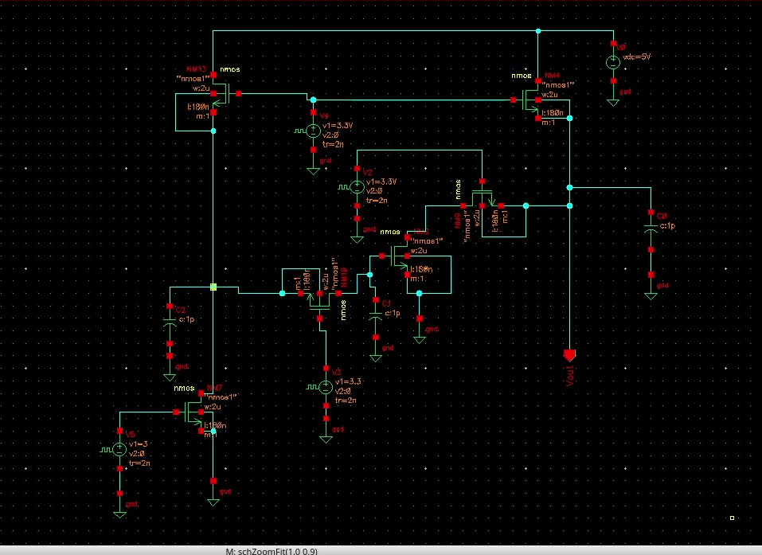
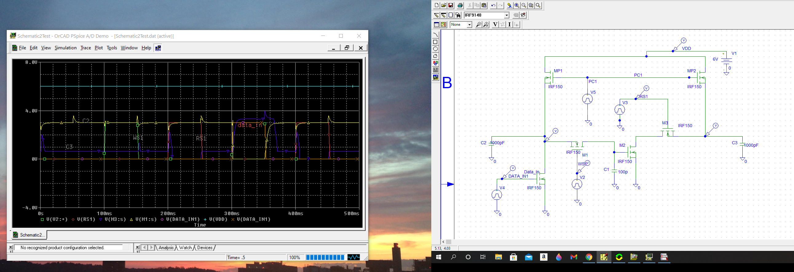
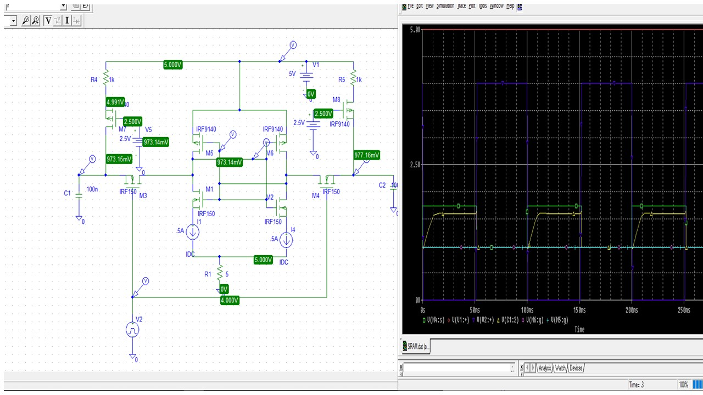

# Digital Integrated Circuit VLSI Design

Provides an overview of the Digital IC VLSI Design Project.

## VLSI Design 

## Schematic Design

## DRAM

## SRAM

## Layout

## VLSI Certification

## Ethics and Excellence

## ASIC Design and Testing Certificate

Advanced knowledge reference :  https://github.com/alpaddesai/FirmwareDesign 
