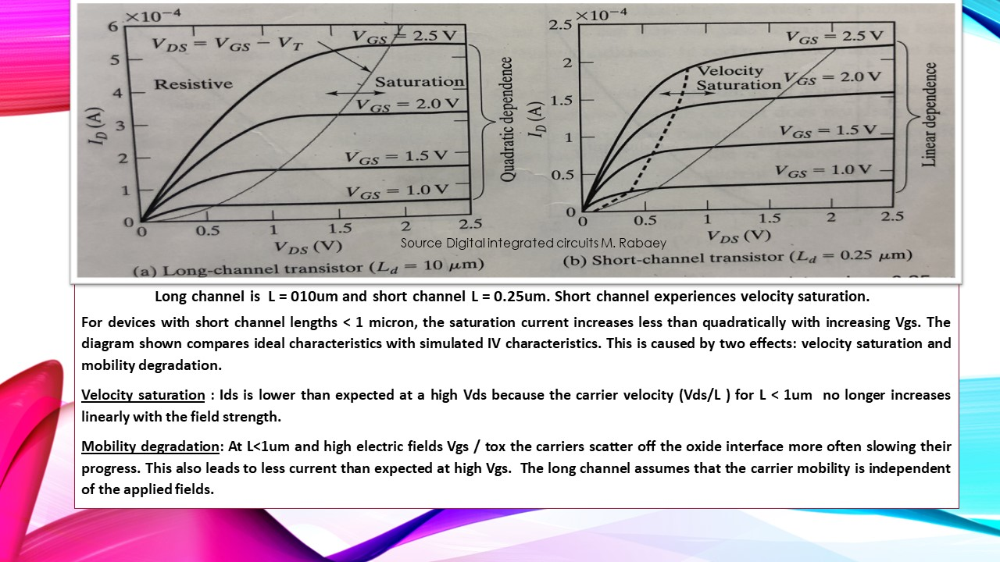

# Digital Iintegrated Cicuit VLSI Design

Provides and overview of the Dgital IC VLSI Design project.

## VLSI

## Schematic Design

## Layout

Advanced knowledge reference :  https://github.com/alpaddesai/Custom_ChipDesign_ASICs_Firmware_SoC

